# AIMOS Database ERD

Dokumen ini mengikuti schema PostgreSQL di `backend/database/schema.sql`.
Kolom `raw_payload JSONB` sengaja dipertahankan di tabel utama agar struktur penuh dari Apify-style JSON tetap tersimpan walaupun hanya field penting yang dinormalisasi ke kolom.

```mermaid
erDiagram
    scrape_runs {
        BIGSERIAL id PK
        TEXT platform
        TEXT dataset_type
        TEXT dataset_file UK
        TEXT query
        TEXT label
        TEXT group_name
        TEXT title
        TEXT goal
        TIMESTAMPTZ scraped_at
        INTEGER total_fetched
        JSONB raw_payload
        TIMESTAMPTZ imported_at
    }

    social_posts {
        BIGSERIAL id PK
        TEXT platform
        TEXT platform_post_id
        TEXT shortcode
        TEXT url
        TEXT creator_username
        TEXT creator_full_name
        BOOLEAN creator_is_verified
        TEXT caption
        TEXT media_type
        TEXT product_type
        INTEGER like_count
        INTEGER comment_count
        INTEGER share_count
        INTEGER play_count
        INTEGER collect_count
        INTEGER duration_seconds
        TEXT music_title
        TEXT thumbnail_url
        TIMESTAMPTZ posted_at
        JSONB raw_payload
        TIMESTAMPTZ first_seen_at
        TIMESTAMPTZ last_seen_at
    }

    scrape_run_posts {
        BIGINT run_id PK,FK
        BIGINT post_id PK,FK
        INTEGER rank
        TEXT source
        TEXT search_source_tag
        JSONB raw_payload
    }

    keyword_posts {
        BIGSERIAL id PK
        BIGINT run_id FK
        BIGINT post_id FK
        TEXT platform
        TEXT keyword
        TEXT source_type
        INTEGER rank
        JSONB raw_payload
        TIMESTAMPTZ imported_at
    }

    post_hashtags {
        BIGINT post_id PK,FK
        TEXT hashtag PK
    }

    post_comments {
        BIGSERIAL id PK
        BIGINT run_id FK
        BIGINT post_id FK
        TEXT platform
        TEXT platform_comment_id
        TEXT parent_comment_id
        TEXT username
        TEXT nickname
        TEXT text
        INTEGER like_count
        INTEGER reply_count
        TIMESTAMPTZ created_at
        TEXT sentiment
        TEXT category
        TEXT language
        BOOLEAN is_hate_speech
        BOOLEAN is_toxic
        BOOLEAN is_sarcasm
        BOOLEAN is_wellwish
        DOUBLE_PRECISION hate_score
        DOUBLE_PRECISION ml_confidence
        TEXT decision_source
        TEXT content_fingerprint
        JSONB raw_payload
        TIMESTAMPTZ imported_at
    }

    creator_profiles {
        BIGSERIAL id PK
        TEXT platform
        TEXT username
        TEXT display_name
        TEXT bio
        TEXT avatar_url
        INTEGER followers
        INTEGER following
        INTEGER posts_count
        INTEGER total_likes
        BOOLEAN is_verified
        BOOLEAN is_private
        TIMESTAMPTZ scraped_at
        JSONB raw_payload
        TIMESTAMPTZ last_seen_at
    }

    analysis_runs {
        BIGSERIAL id PK
        TEXT analysis_id UK
        TEXT kind
        TEXT topic
        TEXT caption
        TEXT stance_target
        TEXT source_dataset
        TEXT model
        TEXT main_model
        TEXT comparison_model
        INTEGER total
        JSONB summary
        JSONB metrics
        JSONB raw_payload
        TIMESTAMPTZ created_at
        TIMESTAMPTZ imported_at
    }

    sentiment_analysis_items {
        BIGSERIAL id PK
        BIGINT analysis_run_id FK
        BIGINT comment_id FK
        INTEGER item_index
        TEXT username
        TEXT text
        TEXT main_label
        DOUBLE_PRECISION main_score
        TEXT comparison_label
        DOUBLE_PRECISION comparison_score
        BOOLEAN agree
        JSONB raw_payload
    }

    procontra_analysis_items {
        BIGSERIAL id PK
        BIGINT analysis_run_id FK
        BIGINT comment_id FK
        INTEGER item_index
        TEXT username
        TEXT text
        TEXT stance
        DOUBLE_PRECISION score
        JSONB scores
        JSONB raw_payload
    }

    scrape_runs ||--o{ scrape_run_posts : contains
    social_posts ||--o{ scrape_run_posts : appears_in
    scrape_runs ||--o{ keyword_posts : indexes
    social_posts ||--o{ keyword_posts : matched_by
    social_posts ||--o{ post_hashtags : has
    scrape_runs ||--o{ post_comments : imports
    social_posts ||--o{ post_comments : receives
    analysis_runs ||--o{ sentiment_analysis_items : stores
    analysis_runs ||--o{ procontra_analysis_items : stores
    post_comments ||--o{ sentiment_analysis_items : analyzed_as
    post_comments ||--o{ procontra_analysis_items : analyzed_as
```

## Dedupe Rules

- `social_posts`: unik berdasarkan `(platform, platform_post_id)`.
- `post_comments`: unik berdasarkan `(platform, platform_comment_id)` dan juga `(platform, content_fingerprint)`.
- `keyword_posts`: unik berdasarkan `(run_id, post_id, keyword)`.
- `post_hashtags`: unik berdasarkan `(post_id, hashtag)`.
- `creator_profiles`: unik berdasarkan `(platform, username)`.
- `analysis_runs`: unik berdasarkan `analysis_id`.

## Apify Field Mapping

- TikTok post: `id`, `text`, `authorMeta`, `musicMeta`, `videoMeta`, `webVideoUrl`, `diggCount`, `shareCount`, `playCount`, `collectCount`, `commentCount`.
- Instagram post: `id`, `shortCode`, `caption`, `url`, `commentsCount`, `latestComments`, `likesCount`, `videoViewCount`, `videoPlayCount`, `ownerUsername`.
- TikTok profile: `authorMeta.name`, `authorMeta.nickName`, `authorMeta.avatar`, `authorMeta.fans`, `authorMeta.video`.
- Instagram profile: `fullName`, `profilePicUrl`, `postsCount`, `followersCount`, `followsCount`, `private`, `verified`, `biography`.
